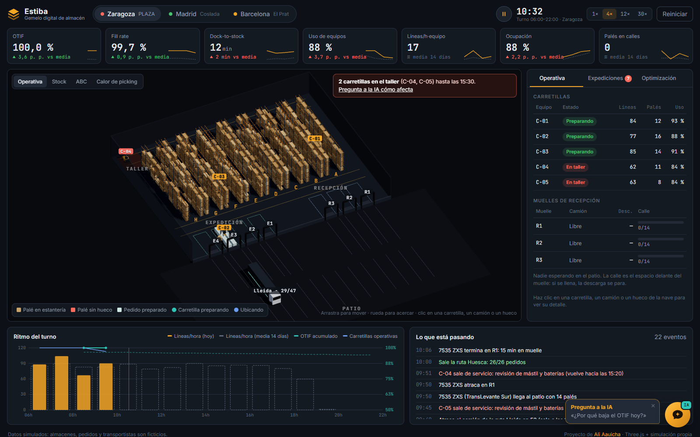
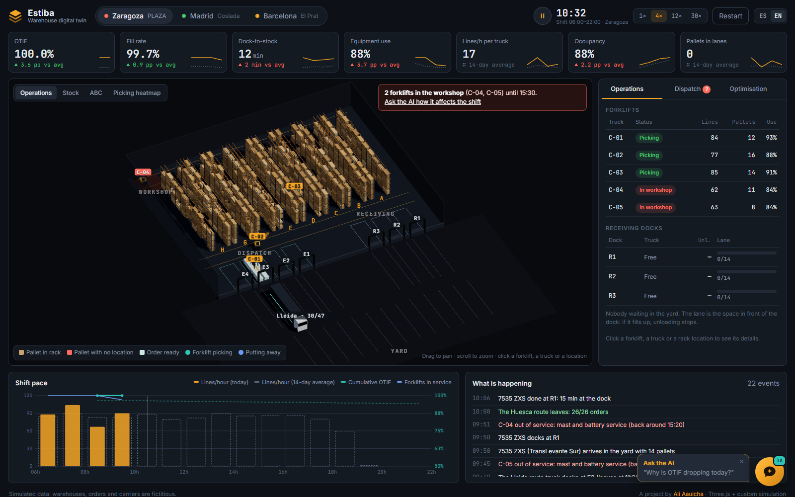

# Estiba · gemelo digital de almacén

*Español · [English](#english)*

La interfaz y el asistente funcionan en español e inglés (botón ES/EN, o `?lang=en` en la URL).

Simulación de un turno de almacén (06:00–22:00) en 3D, con indicadores logísticos, análisis de slotting
y un asistente que explica las desviaciones con los datos del propio turno.

**Demo en vivo: https://d1ex3zlctjya5a.cloudfront.net**

[](https://d1ex3zlctjya5a.cloudfront.net/?lang=es)

No es una maqueta: cada carretilla, camión y palé que se ve sale de un motor de simulación por eventos,
y los indicadores se calculan sobre lo que ocurre en él.

## Qué hace

- **Tres almacenes ficticios** (Zaragoza, Madrid y Barcelona), cada uno con su nave, flota, rutas y un problema distinto:
  - Zaragoza: hoy dos de cinco carretillas pasan por el taller entre las 09:45 y las 15:30.
  - Madrid: el almacén sano, sirve de referencia.
  - Barcelona: la nave va casi llena y el slotting es antiguo.
- **Cadena completa:** camión → patio → muelle → calle de recepción → la carretilla ubica el palé → stock disponible
  → liberación por olas → picking → la ruta sale a su hora. Un fallo en un eslabón se ve en los siguientes.
- **Indicadores:** OTIF, fill rate de líneas, dock-to-stock, utilización y productividad de equipos, ocupación y palés en calles.
  Cada uno se compara con la media de los 14 días anteriores **a la misma hora**.
- **Vistas de la nave:** operativa, nivel de stock por hueco, clasificación ABC y calor de picking.
- **Expediciones:** estado de cada ruta y previsión de riesgo (trabajo pendiente frente a minutos de carretilla disponibles).
- **Optimización:** compara «como está», «ruta optimizada» y «slotting ABC + ruta» sobre los pedidos del día, lista los
  cambios de ubicación de más impacto y permite re-simular el día con el slotting propuesto.
- **Asistente:** responde a preguntas como «¿por qué baja el OTIF?», «¿qué rutas están en riesgo?» o «¿qué hago ahora?»
  recorriendo la cadena de causas. Va en una burbuja flotante; el diagnóstico se calcula en el navegador y Claude
  (Amazon Bedrock) redacta la respuesta a partir de él (`lambda/asistente`).

## Cómo está hecho

| Pieza | Fichero |
| --- | --- |
| Geometría de la nave, distancias reales por pasillos, rutas | `src/sim/layout.js` |
| Motor de simulación (pasos de 15 s, determinista por semilla) | `src/sim/engine.js` |
| Histórico de 14 días y línea base por hora | `src/analysis/history.js` |
| Slotting ABC y secuencia de picking | `src/analysis/optimize.js` |
| Diagnóstico y asistente | `src/analysis/assistant.js` |
| Escena 3D (Three.js, instancias, sombras, etiquetas CSS2D) | `src/scene/warehouse3d.js` |
| Interfaz | `src/main.js`, `src/ui/*` |

Sin frameworks: Vite + Three.js + JavaScript. En producción: S3 + CloudFront (con OAC) para la web y una Lambda
con Function URL para el asistente (`deploy.ps1`).

## Uso

```bash
npm install
npm run dev        # http://localhost:5190
npm test           # pruebas del motor, el slotting y el asistente
npm run build      # genera dist/
node scripts/probar-dia.mjs 5   # indicadores de 5 días por almacén, para calibrar
```

**En vivo:** el reloj del almacén es la hora real de España y la simulación avanza minuto a minuto, como un
panel de operaciones de verdad. El turno es de 06:00 a 22:00; de noche se reproduce el turno de día en diferido
(con el aviso «EN DIFERIDO») para que siempre haya actividad. Esc quita la selección.

## Asistente con Bedrock (opcional)

1. Crear una Lambda (Node.js 22) con `lambda/asistente/index.mjs`, permiso `bedrock:InvokeModel` sobre el modelo
   y una Function URL con CORS limitado al dominio de la web. Variable opcional: `TOPE_DIARIO`.
2. Compilar la web con la URL: `VITE_ESTIBA_API=https://…lambda-url…/ npm run build`.

Sin esa variable, el asistente responde solo con el motor local.

## Aviso

Todos los datos son simulados: almacenes, pedidos, proveedores y transportistas son ficticios.

Autor: [Ali Aauicha](https://www.linkedin.com/in/ali-aauicha/)

---

## English

**Estiba** is a 3D warehouse digital twin. It simulates a full shift (06:00–22:00), from trucks arriving in the yard
to routes leaving on time, and every forklift, truck and pallet on screen comes from that simulation.

**Live demo: https://d1ex3zlctjya5a.cloudfront.net/?lang=en**

[](https://d1ex3zlctjya5a.cloudfront.net/?lang=en)

- **Live:** the warehouse clock is real Spain time and the simulation runs minute by minute, like a real operations
  dashboard. The shift runs 06:00–22:00; at night the day shift is replayed (marked "REPLAY").
- **Three fictional warehouses** (Zaragoza, Madrid, Barcelona), each with its own issue: two forklifts in the
  workshop, a healthy baseline, and a nearly full building with old slotting.
- **End-to-end flow:** yard → dock → receiving lane → put-away → stock available → wave release → picking → route departure.
  A failure in one link shows up in the next ones.
- **KPIs:** OTIF, line fill rate, dock-to-stock, equipment utilisation and productivity, occupancy and pallets in lanes,
  each compared with the average of the previous 14 days **at the same time of day**.
- **Optimisation:** "as is" vs "optimised routing" vs "ABC slotting + routing" on today's orders, the highest-impact
  relocations, and a full re-simulation of the day with the proposed slotting.
- **AI assistant** (floating bubble): answers "why is OTIF dropping?", "which routes are at risk?" or "what should I do now?"
  by walking the chain of causes. The diagnosis is computed in the browser; Claude on Amazon Bedrock writes the answer
  from it, in the interface language.

Built with Vite + Three.js + plain JavaScript; deployed on S3 + CloudFront (OAC) with a Lambda Function URL for the
assistant. `npm install`, `npm run dev`, `npm test`. All data is simulated.

Author: [Ali Aauicha](https://www.linkedin.com/in/ali-aauicha/)
